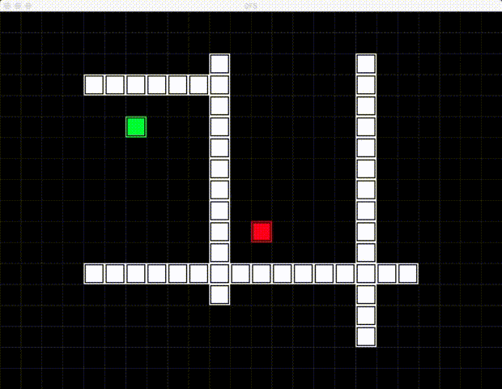
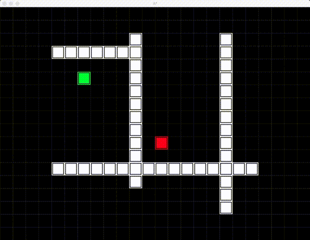

# python-game-snake

python-game-snake is a Snake Game including three path-searching-algorithm demos and one version of AI to play Snake automatically.

The project is implemented in [Python3.6](https://www.python.org/downloads/).

**If you like it, Please give it a star, Thanks!**


## Require

You should have `pygame` module [installed](http://www.pygame.org/wiki/GettingStarted#Pygame).


## Usage

Get the source code.

```shell
git clone https://github.com/manerfan/python-game-snake.git
cd python-game-snake/src
```


### Path Searching Algorithm Demos

#### DFS

```shell
python3 dfs_demo.py
```




#### BFS

```shell
python3 bfs_demo.py
```


#### A*

```shell
python3 a_star_demo.py
```




### Play Snake Automatically

Play Snake Automatically with A* Algorithm.

```shell
python3 snake_ai.py
```


